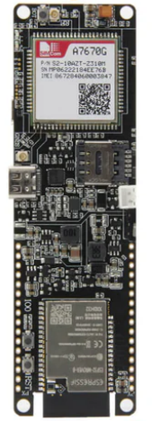
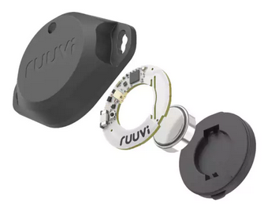

# Getting started as of 11.3.2025 14:32
1. Clone repository
2. Navigate to project directory `cd <project-directory>`
3. Check branches `git branch -a`
4. Switch to Vladimir branch `git checkout Vladimir`
5. Pull the latest changes `git pull origin Vladimir`
6. Clone esp-protocols: Navigate to `C:\Users\USER_NAME\esp\v5.4\esp-idf\components` and execute command: `git clone --recursive https://github.com/espressif/esp-protocols.git`
7. Make sure ESP-IDF v5.4.0 is selected
8. To build: In ESP-IDF terminal: `idf.py build`
9. Connect ESP32 device via USB
10. To flash and monitor: In ESP-IDF terminal: `idf.py flash monitor`

## For changes:
6. Create own branch for your changes (if needed) `git checkout -b my-feature-branch`
7. Make changes and commit them: `git add .` `git commit -m "Description of changes"`
8. Push branch to remote repository `git push my-feature-branch:target-branch`
9. Create pull request!

# Project Overview

### Hardware

- **Development board** 
Lilygo T-A7670E Wireless module ESP32 Chip 4G LTE CAT1 MCU32 

- **Sensor** 
RuuviTag Pro Bluetooth Sensor 

### Main Components

- **Main Logic** (`main.c`): Handles the overall workflow, including sensor data collection, storage and transmission.
- **Storage** (`storage.c`): Manages data storage using SPIFFS (SPI Flash File System) and NVS (Non-Volatile Storage) for boot count, error flags, and system state.
- **Sensors** (`sensor.c`): Interfaces with a RuuviTag sensor via BLE (Bluetooth Low Energy) to collect temperature and humidity data.
- **GSM Modem** (`gsm_modem.cpp`)
- **Discord API** (`discord_api.cpp`): Handles HTTP requests to send messages to a Discord channel.
- **Power Management** (`power_management.c`): Configures power management settings for the ESP32.
- **JSON Helper** (`json_helper.c`): Converts sensor data into JSON format for storage and transmission.

### Workflow

- **Initialization**: The system initializes power management, storage, sensors and the GSM modem.
- **Data collection**: The RuuviTag sensor data is collected via BLE and stored in SPIFFS.
- **Data transmission**: After a certain number of boot cycles (`SEND_DATA_CYCLE`), the accumulated data is sent to Discord via the GSM module.
- **Error handling**: If an error occurs (e.g., GSM initialization fails), the system logs the error and restarts.
- **Sleep mode**: The ESP32 enters deep sleep mode after each cycle to save power.

# Working logic

1. **Boot process**:
- The system checks the boot count and system state from NVS.
- If it's the first boot, it initializes the GSM modem and sends a startup message to Discord
- If it's a normal boot, it proceeds with data collection and transmission

2. **Data collection**:
- The RuuviTag sensor data is collected via BLE and stored in a JSON file in SPIFFS
- The system waits up to 10 seconds to receive sensor data.

3. **Data transmission**:
- After `SEND_DATA_CYCLE` boot cycles, the system sends the accumulated data to Discord.
- If the transmission fails, it retries up to 3 times.

4. **Sleep mode**:
- After completing the cycle, the ESP32 enter deep sleep for `TIME_TO_SLEEP` seconds.
