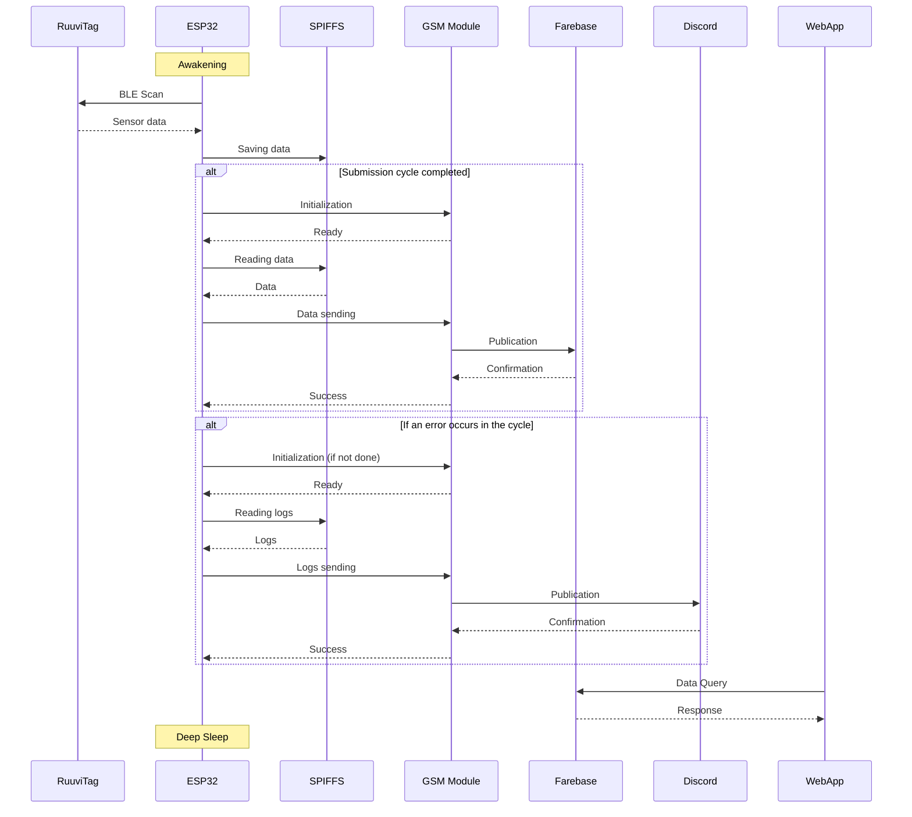

```mermaid
sequenceDiagram
    participant RT as RuuviTag
    participant ESP as ESP32
    participant Storage as SPIFFS
    participant GSM as GSM Module
    participant Farebase as Farebase
    participant Discord as Discord
    participant WebApp as WebApp
    Note over ESP: Awakening
    ESP->>RT: BLE Scan
    RT-->>ESP: Sensor data
    ESP->>Storage: Saving data
    alt Submission cycle completed
        ESP->>GSM: Initialization
        GSM-->>ESP: Ready
        ESP->>Storage: Reading data
        Storage-->>ESP: Data
        ESP->>GSM: Data sending
        GSM->>Farebase: Publication
        Farebase-->>GSM: Confirmation
        GSM-->>ESP: Success
    end
    alt If an error occurs in the cycle
        ESP->>GSM: Initialization (if not done)
        GSM-->>ESP: Ready
        ESP->>Storage: Reading logs
        Storage-->>ESP: Logs
        ESP->>GSM: Logs sending
        GSM->>Discord: Publication
        Discord-->>GSM: Confirmation
        GSM-->>ESP: Success
    end
    WebApp->>Farebase: Data Query
    Farebase-->>WebApp: Response
    Note over ESP: Deep Sleep
``` 